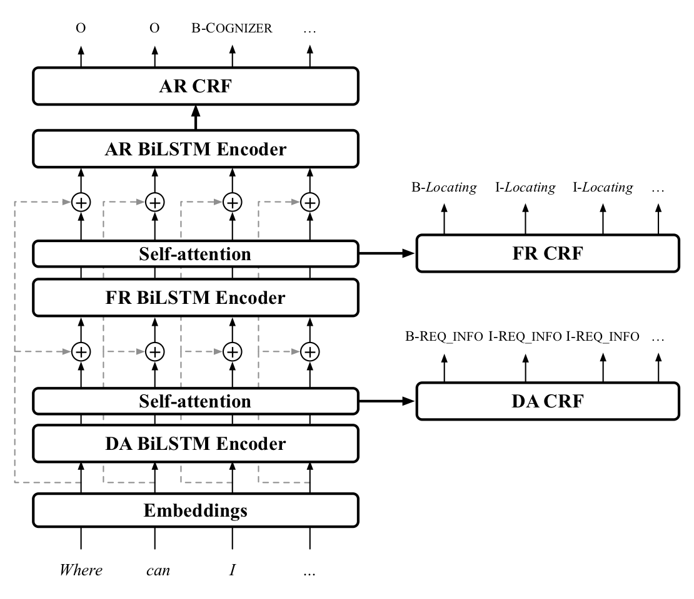

# HERMIT NLU - HiERarchical MultI-Task Natural Language Understanding

*HERMIT NLU* is a new neural architecture for wide-coverage Natural Language Understanding in Spoken Dialogue Systems. It is based on a hierarchical multi-task architecture, which delivers a multi-layer representation of sentence meaning (i.e., Dialogue Acts and Frame-like structures). The architecture is a hierarchy of self-attention mechanisms and BiLSTM encoders followed by CRF tagging layers.

<center>
	
</center>

Several experiments have been performed, showing that this approach obtains promising results on a dataset annotated with Dialogue Acts and Frame Semantics.
HERMIT can also model application-oriented annotation schemes. Experiments over a publicly available NLU dataset annotated with domain-specific intents and corresponding semantic roles, show that HERMIT provides overall performance higher than state-of-the-art tools such as RASA, Dialogflow, LUIS, and Watson.

For more details, refer to the paper at the end of the page.


## Dependecies and installation

Make sure **Python 2.7** is installed on your machine.
To setup HERMIT NLU, start by cloning the repository:

```
git clone https://gitlab.com/hwu-ilab/hermit-nlu.git && cd hermit-nlu
```
### [OPTIONAL] Virtual environment (recommended)
You can create a virtual environment if needed (recommended):

```
sudo pip install -U virtualenv
virtualenv --system-site-packages -p python2.7 ./hermit-venv
```
and activate it:

```
source ./hermit-venv/bin/activate
```

### Requirements installation
If you have a GPU, modify the `requirements.txt` to install `tensorflow-gpu` instead of the CPU version (`tensorflow`). Then install the dependencies:

```
pip install --upgrade pip
pip install -r requirements.txt
```

Download and install the English model for [spaCy](https://spacy.io):

```
python -m spacy download en
```

### Dataset download and conversion

To evaluate and train HERMIT NLU, you need to download the [NLU-Benchmark](https://github.com/xliuhw/NLU-Evaluation-Data) dataset:

```
git clone https://github.com/xliuhw/NLU-Evaluation-Data.git
```
and then run the conversion script:

```
python data/nlu_benchmark/nfold_converters.py NLU-Evaluation-Data/CrossValidation/autoGeneFromRealAnno/autoGene_2018_03_22-13_01_25_169/CrossValidation -o datasets/nlu_benchmark_hrc2 
```

The original files are not needed.

## Evaluation

To evaluate the system:

```
chmod +x evaluate.sh && ./evaluate.sh
``` 

The script will perform a 10Fold evaluation over the NLU-Benchmark dataset and generate the folder `resource/evaluation`. The files in `resource/evaluation/results` refer to the exact match reported in the paper, and to the CoNLL spanF1.

A script computes the metrics reported in Table 3 and 4:

```
python data/nlu_benchmark/evaluation.py -f resources/evaluation/predictions/
```

 
## Usage

If you want to use the system as a server, the models have to be trained:

```
python main.py -n hermit -m training --run-folder training -d datasets/nlu_benchmark_hrc2/KFold_1 --gpu 0
```

Then, you can run the server:

```
python server.py -n hermit -o json --run-folder resources/training -p 9876
```

A simple client is provided to query the server and obtain the interpretations:

```
python client.py
```


## References

Please consider citing the following paper if you find this repository useful.

```

@inproceedings{vanzo:2019b,
	Address = {Stockholm, Sweden},
	Author = {Vanzo, Andrea and Bastianelli, Emanuele and Lemon, Oliver},
	Booktitle = {Proceedings of the 20th Annual SIGdial Meeting on Discourse and Dialogue},
	Doi = {10.18653/v1/W19-5931},
	Month = sep,
	Pages = {254--263},
	Publisher = {Association for Computational Linguistics},
	Title = {Hierarchical Multi-Task Natural Language Understanding for Cross-domain Conversational {AI}: {HERMIT} {NLU}},
	Url = {https://www.aclweb.org/anthology/W19-5931},
	Year = {2019}
	}

```